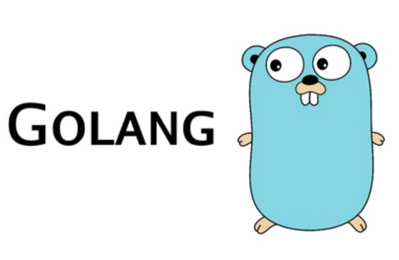
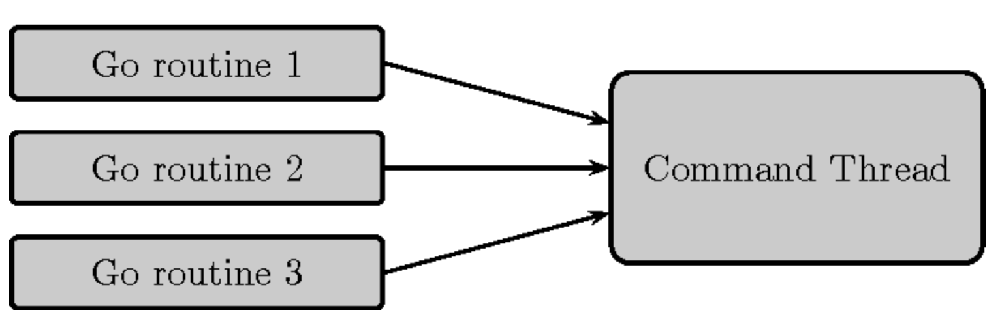

# gotudy
Go language에 대해 공부를 시작하며 내용을 업데이트 할 공간 생성.
* https://golang.org/

# 장점 및 특징

## 간결한 문법
> go는 nodejs 처럼 스크립트 언어는 `컴파일 언어`이며, C언어 처럼 `main()`함수가 필요 하지만  언어의 차원에서 객체지향의 상징인 `클래스`를 배제함으로써 언어 자체가 단순해졌고, 복잡하기 그지없는 객체지향적 개념을 조금이나마 줄이기 위한 노력을 했다.
```go
package main
import "fmt"

func main() {
	fmt.Println("hello world")
}
```
> 표현의 방법을 달리했을 뿐, 일부 부분은 객체지향에서 가져오긴 했였다. method, 캡슐화라. 물론 상속이 없기 때문에 키워드같은 것은 존재하지 않으며 특이하게도 소문자로 캡슐화를 할 수 있다.
> 또한 반복문은 오질 `for` 하나 뿐이다. 

## 간편한 동시성 제어
> Go 언어의 루틴을 통해 쓰레드를 생성해 실행한다. 병행성을 이용하면 프로그램이 서로 소통하는 동시성 프로그램을 만들 수 있다.

### goroutine
> 고루틴은 프로그램의 진입점 함수를 비롯하여 다른 고루틴과 함께 동시에 실행되는 함수이다.
>
> 만약 다른 프로그래밍에서 이런 일을 가능하게 할려면 스레드를 사용해야 하지만, go에서는 여러 개의 고루틴이 하나의 스레드에서 동작한다.
> 


### goroutine 동작
> M:N Thread 모델을 이용해서 multi-core도 쓰고 cotext swiching 속도도 잡도록 해서 성능을 높혔다. 그리고 개발자는 아랫단이 어떻게 구현했는지 알 필요 없이 사용할 수 있도록 Goroutines와 Channels 개념으로 API를 제공한다.
> 
> 
> 그래도 대략적인 것은 알고 있어야 하기에 찾아보니, 데이터를 주고받을 때 공유 메모리를 사용하지 않고 채널이라는 개념을 도입해 채널을 통해 데이터를 주고 받는다고 한다.
> 
> 
> 또한 멀티플렉싱 방식으로 운영체제의 도움 없이 내부적으로 동시성 있게 돌기 때문에, context에 대한 부담이 적다고 한다.

### Goroutines vs Thread
> Memory: Java Thread의 경우 1Mb 를 필요로 하는데 비해 Goroutines는 2Kb만 있으면 된다.
> 결국 Java의 경우는 많은 Thread를 생성하면 OutOfMemoryError 가 날 확률이 높다.

> Setup and teardown: Thread를 setup하고 teardown하는데 OS에 요청을 하고 돌려줘야하기에 runtime에 의해 생성되고 정리되는 Goroutine에 비해 상대적으로 비용이 많이 든다. 

> Switching: `Thread간 switching`은 관련된 모든 register (6 general purpose registers, PC (Program Counter), SP (Stack Pointer), segment registers, 16 XMM registers, FP coprocessor state, 16 AVX registers, all MSRs etc...) 를 save/restore하는데 비해 `Goroutines`는 3개의 register (Program Counter, Stack Pointer and DX)만 save/restore하면 된다. 그러니 상대적인 cost가 낮아지게 된다.

## Simplicity
> * Python과 다른점이 type을 정의해야하고 또 C와도 다른점이 `Strongly-typed 언어`라는것. 
> * C에서는 int 와 float 과의 계산시 int를 float로 형전환을 알아서 해준다면, GO에서는 에러를 발생시키기 때문에 프로그램에서 명시적으로 형전환을 해줘야한다.

> * 이 부분이 관점에 따라서 불편할 수 도 있지만 Type을 혼합해서 사용한 것으로 인해 디버깅을 해본 사람이라면 이 부분도 차라리 명확해서 장점이 될 수 있다.

> 또 다른 특징은 `대소문자 구분으로 public, private을 구분하는 것`이다. Python과 Java 의 경우 Scope가 private, public, protected 로 되어있고 명시적으로 표시하는데 비해서 Go는 대문자는 public (다른 package에서 접근 가능), 소문자는 private (같은 package에서 접근 가능) 이라 simple하다.

> 하지만 두가지 scope만 제공하는 것을 단점으로 드는 사람도 많다. 같은 package안에서는 막을 방법이 없으니 잘 모르는 다른 개발자가 아무 생각없이 같은 package에 있는 건드리면 안되는 data를 변경하는 경우도 있다는 것이다.

## Garbage Collection
> golang은 메모리를 관리해주는 가비지 컬렉터가 실행 파일안에 내장되어 있어서, 가상머신위에서 실행되는 언어들처럼 가상 머신이 메모리를 관리를 해주는 것과 차이가 있다.
> GC가 있어 메모리 관리에 신경 쓰지 않고, 로직 작성에 집중할 수 있다. 따라서 스크립트 언어(가상 머신 위에서 실행되는 언어)처럼 생산성이 높고 C, C++처럼 빠른 성능이 장점이 되는 부분이다.


## 오픈소스, 패키지 레지스트리 탈 중앙화
> 패키지를 특정 레지스트리(npm, packagist)와 같은 곳에 올려 두지 않고, github에서 직접 가지고 오는 방식을 택하였다. `go get`을 통해 손쉽게 가지고 올 수 있다.

# 단점 요약
* 바이트코드를 생성하는 언어가 아니므로, 바이너리만 배포할 경우 C/C++ 프로그램이 그렇듯 배포되는 머신에 맞춰서 각각 컴파일해야 한다. 그렇게 하지 않고서 다중 플랫폼을 지원하려면 소스 코드째로 배포해야 한다.
* 없는게 산더미...
  * 제네릭 문법 없음. 클래스 문법 없음(OOP Bye~), 예외 처리 문법 없음, Public, Private 키워드 없음, this 문법 없음
  * 메서드를 만들 수 있으며 인터페이스를 이용해서 다형성을 구현할 수 있다. Composition으로 상속을 대신할 수 있다.
  * 덱과 같은 자료형이 제공되지 않는다. (알고리즘 풀때 어렵...)
  * 솔직히 문법이 처음 접하면 적응이 안됨...

# 참고
* [Go Docs](https://golang.org/doc)
* [구름 IDE Go 강좌](https://edu.goorm.io/learn/lecture/2010/%ED%95%9C-%EB%88%88%EC%97%90-%EB%81%9D%EB%82%B4%EB%8A%94-%EA%B3%A0%EB%9E%AD-%EA%B8%B0%EC%B4%88)
* [프로덕션 환경에서 사용하는 golang과 gRPC](https://blog.banksalad.com/tech/production-ready-grpc-in-golang)